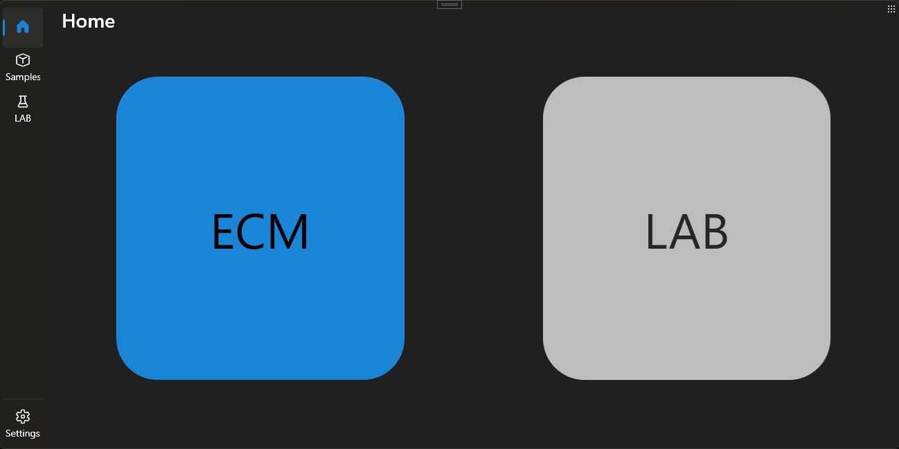
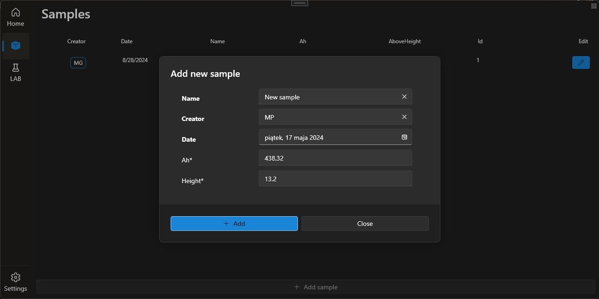
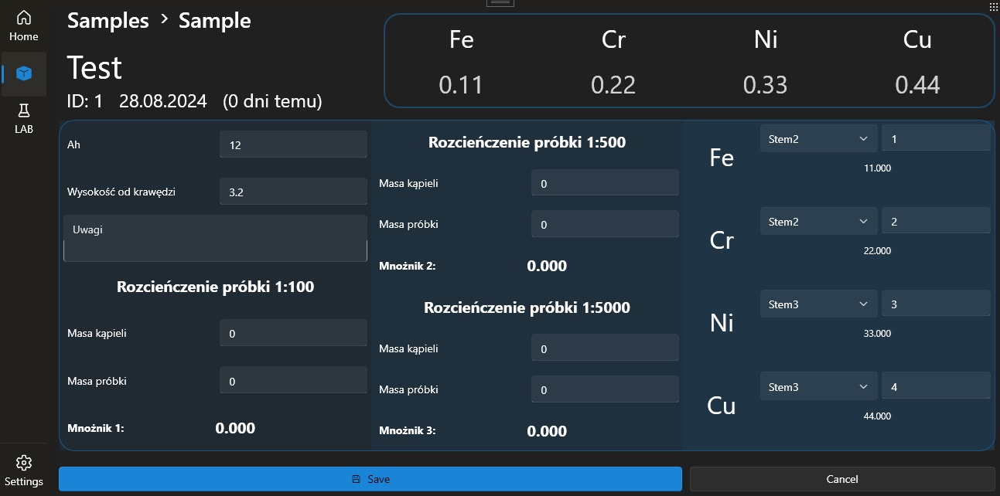

# Chroma Resolver

Scientific project by <b>Magdalena Polerowicz</b>

&nbsp;

### Samples collector with built-in calculator 
- Data analyzis tool
- Data collector tool
- Samples editor 
- Powered by EF database
 

## Main page

    

## Adding new sample

    

## Sample details

    

## References & Acknowledgements

 <b>Expand</b> 

        
* [EF SQLite](https://learn.microsoft.com/pl-pl/ef/core/providers/sqlite/?tabs=dotnet-core-cli)
* [WPF UI 3](https://wpfui.lepo.co)
* [.NET Core 8](https://dotnet.microsoft.com/en-us/download/dotnet/8.0)

